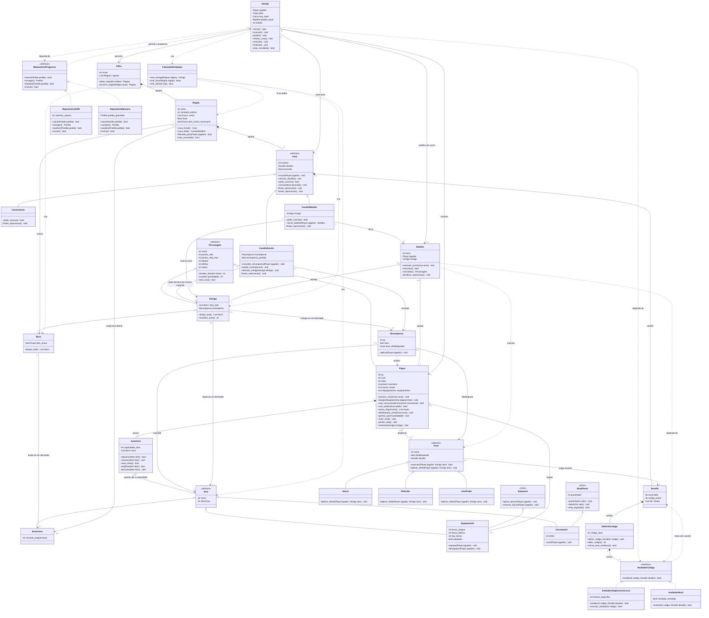

```mermaid
classDiagram
    %% ===== Personagens =====
    class Personagem {
        <<abstract>>
        -str nome
        -int pontos_vida
        -int pontos_vida_max
        -int ataque
        -int defesa
        -str status
        +receber_dano(int dano) int
        +curar(int quantidade) int
        +esta_vivo() bool
    }

    class Player {
        -int xp
        -int nivel
        -int vidas
        -Inventario inventario
        -List~Acao~ acoes
        -List~Equipamento~ equipamentos
        +avancar_casa(Casa casa) void
        +equipar(Equipamento equipamento) void
        +usar_consumivel(Consumivel consumivel) void
        +usar_poder(Acao poder) bool
        +acoes_disponiveis() List~Acao~
        +desbloquear_acao(Acao acao) void
        +ganhar_xp(int quantidade) void
        +subir_nivel() void
        +perder_vida() void
        +enfrentar(Inimigo inimigo) void
    }

    class Inimigo {
        -List~Item~ itens_loot
        -Recompensa recompensa
        +dropar_loot() List~Item~
        +escolher_acao() str
    }

    class Boss {
        -ItemChave item_chave
        +dropar_loot() List~Item~
    }

    %% ===== Itens =====
    class Item {
        <<abstract>>
        -str nome
        -str descricao
    }

    class Equipavel {
        <<mixin>>
        +aplicar_bonus(Player jogador) void
        +remover_bonus(Player jogador) void
    }

    class Empilhavel {
        <<mixin>>
        -int quantidade
        +aumentar(int valor) void
        +reduzir(int valor) void
        +esta_esgotado() bool
    }

    class ItemChave {
        -str conceito_programacao
    }

    class Equipamento {
        -int bonus_ataque
        -int bonus_defesa
        -str tipo_bonus
        -bool equipado
        +equipar(Player jogador) void
        +desequipar(Player jogador) void
    }

    class Consumivel {
        -int efeito
        +usar(Player jogador) void
    }

    class Inventario {
        -int capacidade_slots
        -List~Item~ itens
        +adicionar(Item item) bool
        +remover(Item item) void
        +esta_cheio() bool
        -empilhar(Item item) bool
        -descartar(Item item) void
    }

    class Recompensa {
        -int xp
        -Item item
        -Acao acao_desbloqueada
        +aplicar(Player jogador) void
    }

    %% ===== Ações e desafios =====
    class Acao {
        <<abstract>>
        -str nome
        -bool desbloqueada
        -Desafio desafio
        +executar(Player jogador, Inimigo alvo) bool
        #aplicar_efeito(Player jogador, Inimigo alvo) void
    }

    class Atacar {
        #aplicar_efeito(Player jogador, Inimigo alvo) void
    }

    class Defender {
        #aplicar_efeito(Player jogador, Inimigo alvo) void
    }

    class UsarPoder {
        #aplicar_efeito(Player jogador, Inimigo alvo) void
    }

    class Desafio {
        -str enunciado
        -str codigo_inicial
        -List~str~ testes
    }

    class EditorDeCodigo {
        -str codigo_atual
        +definir_codigo_inicial(str codigo) void
        +obter_codigo() str
        +enviar_para_avaliacao() bool
    }

    %% ===== Avaliação (DIP) =====
    class IAvaliadorCodigo {
        <<interface>>
        +avaliar(str codigo, Desafio desafio) bool
    }

    class AvaliadorSubprocessoLocal {
        -int timeout_segundos
        +avaliar(str codigo, Desafio desafio) bool
        -executar_isolado(str codigo) bool
    }

    class AvaliadorMock {
        -bool resultado_simulado
        +avaliar(str codigo, Desafio desafio) bool
    }

    %% ===== Estrutura do jogo =====
    class Trilha {
        -str nome
        -List~Regiao~ regioes
        +obter_regiao(int indice) Regiao
        +proxima_regiao(Regiao atual) Regiao
    }

    class Regiao {
        -str nome
        -str conteudo_python
        -List~Casa~ casas
        -Boss boss
        -ItemChave item_chave_necessario
        +casa_inicial() Casa
        +casa_final() CasaDeBatalha
        +liberada_para(Player jogador) bool
        +esta_concluida() bool
    }

    class Casa {
        <<abstract>>
        -int numero
        -Desafio desafio
        -bool concluida
        +iniciar(Player jogador) void
        +reiniciar_desafio() void
        +pode_concluir() bool
        +concluir(bool aprovado) void
        #tratar_aprovacao() void
        #tratar_reprovacao() void
    }

    class CasaComum {
        +pode_concluir() bool
        #tratar_reprovacao() void
    }

    class CasaDeEvento {
        -Recompensa recompensa
        -bool recompensa_perdida
        +conceder_recompensa(Player jogador) void
        +perder_recompensa() void
        +derrotar_inimigo(Inimigo inimigo) void
        #tratar_reprovacao() void
    }

    class CasaDeBatalha {
        -Inimigo inimigo
        +pode_concluir() bool
        +iniciar_batalha(Player jogador) Batalha
        #tratar_reprovacao() void
    }

    class Batalha {
        -int turno
        -Player jogador
        -Inimigo inimigo
        +executar_turno(Acao acao) void
        +terminou() bool
        +vencedor() Personagem
        -penalizar_reprovacao() void
    }

    class FabricaDeEntidades {
        +criar_inimigo(Regiao regiao) Inimigo
        +criar_boss(Regiao regiao) Boss
        +criar_item(str tipo) Item
    }

    %% ===== Partida e persistência =====
    class Partida {
        -Player jogador
        -Trilha trilha
        -Casa casa_atual
        -Batalha batalha_atual
        -str estado
        +iniciar() void
        +avancar() void
        +perder() void
        +refazer_casa() void
        +reiniciar() void
        +finalizar() void
        +esta_concluida() bool
    }

    class IRepositorioProgresso {
        <<interface>>
        +salvar(Partida partida) bool
        +carregar() Partida
        +atualizar(Partida partida) bool
        +excluir() bool
    }

    class RepositorioJSON {
        -str caminho_arquivo
        +salvar(Partida partida) bool
        +carregar() Partida
        +atualizar(Partida partida) bool
        +excluir() bool
    }

    class RepositorioMemoria {
        -Partida partida_guardada
        +salvar(Partida partida) bool
        +carregar() Partida
        +atualizar(Partida partida) bool
        +excluir() bool
    }

    %% ===== Herança e realização =====
    Personagem <|-- Player
    Personagem <|-- Inimigo
    Inimigo <|-- Boss
    Item <|-- ItemChave
    Item <|-- Equipamento
    Item <|-- Consumivel
    Equipavel <|-- Equipamento
    Empilhavel <|-- Consumivel
    Acao <|-- Atacar
    Acao <|-- Defender
    Acao <|-- UsarPoder
    Casa <|-- CasaComum
    Casa <|-- CasaDeEvento
    Casa <|-- CasaDeBatalha
    IAvaliadorCodigo <|.. AvaliadorSubprocessoLocal
    IAvaliadorCodigo <|.. AvaliadorMock
    IRepositorioProgresso <|.. RepositorioJSON
    IRepositorioProgresso <|.. RepositorioMemoria

    %% ===== Player, inventário e ações =====
    Player "1" *-- "1" Inventario : possui
    Player "0..1" o-- "0..*" Equipamento : equipa
    Inventario "0..1" o-- "0..*" Item : guarda até a capacidade
    Player "0..1" o-- "0..*" Acao : dispõe de

    %% ===== Recompensas e loot =====
    Recompensa "0..1" --> "0..1" Item : concede
    Recompensa "0..1" --> "0..1" Acao : desbloqueia
    Recompensa ..> Player : recebe
    Inimigo "0..1" --> "0..1" Recompensa : entrega ao ser derrotado
    Inimigo "0..1" --> "1..*" Item : dropa ao ser derrotado
    Boss "1" --> "1..*" ItemChave : dropa ao ser derrotado
    CasaDeEvento "0..1" --> "1" Recompensa : concede
    CasaDeEvento "0..1" --> "0..1" Inimigo : pode derrotar por evento especial

    %% ===== Desafio, editor e avaliador =====
    Casa "0..1" *-- "1" Desafio : contém
    Acao "0..1" --> "1" Desafio : exige resolver
    Desafio "1" *-- "1" EditorDeCodigo : contém
    EditorDeCodigo "1" *-- "1" IAvaliadorCodigo : possui
    IAvaliadorCodigo ..> Desafio : testa com asserts
    Partida ..> IAvaliadorCodigo : depende de
    Batalha ..> IAvaliadorCodigo : depende de

    %% ===== Estrutura do jogo =====
    Trilha "1" *-- "1..*" Regiao : agrupa
    Regiao "1" *-- "1..*" Casa : agrupa
    Regiao "1" --> "1" Boss : possui
    Regiao "0..1" --> "0..1" ItemChave : exige para liberar

    %% ===== Batalha =====
    CasaDeBatalha "1" --> "1" Inimigo : rival da casa
    CasaDeBatalha "1" --> "0..*" Batalha : inicia
    Batalha "0..1" o-- "1" Player : agrega
    Batalha "0..1" o-- "1" Inimigo : agrega
    Batalha ..> Acao : executa

    %% ===== Partida =====
    Partida "1" --> "1" Player : controla
    Partida "1" --> "1" Trilha : percorre
    Partida "0..1" --> "1" Casa : casa atual
    Partida "1" --> "0..1" Batalha : batalha em curso
    Partida ..> IRepositorioProgresso : depende de
    IRepositorioProgresso ..> Partida : persiste o progresso

    %% ===== Fábrica =====
    Partida ..> FabricaDeEntidades : usa
    FabricaDeEntidades ..> Regiao : lê os dados
    FabricaDeEntidades ..> Inimigo : cria
    FabricaDeEntidades ..> Boss : cria
    FabricaDeEntidades ..> Item : cria

```
