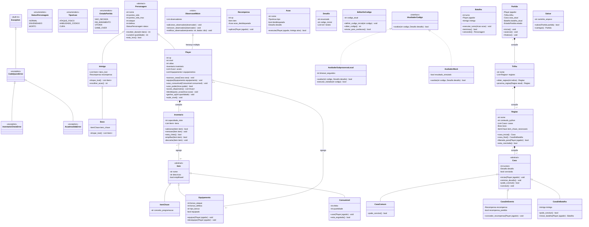

```mermaid
classDiagram
    %% ===== Exceções Personalizadas =====
    class Exception {
        <<built-in>>
    }
    class CodeQuestError {
        <<exception>>
    }
    class InventarioCheioError {
        <<exception>>
    }
    class AcaoInvalidaError {
        <<exception>>
    }
    Exception <|-- CodeQuestError
    CodeQuestError <|-- InventarioCheioError
    CodeQuestError <|-- AcaoInvalidaError

    %% ===== Enums =====
    class StatusPersonagem {
        <<enumeration>>
        NORMAL
        ENVENENADO
        MORTO
    }

    class TipoAcao {
        <<enumeration>>
        ATAQUE_FISICO
        HABILIDADE_CODIGO
        CURA
    }

    class EstadoPartida {
        <<enumeration>>
        NAO_INICIADA
        EM_ANDAMENTO
        VITORIA
        GAME_OVER
    }

    %% ===== Mixins e Padrões (Observer) =====
    class ObservavelMixin {
        <<mixin>>
        -List observadores
        +adicionar_observador(observador) void
        +remover_observador(observador) void
        +notificar_observadores(evento: str, dados: dict) void
    }

    %% ===== Personagens =====
    class Personagem {
        <<abstract>>
        -str nome
        -int pontos_vida
        -int pontos_vida_max
        -int ataque
        -int defesa
        -StatusPersonagem status
        +receber_dano(int dano) int
        +curar(int quantidade) int
        +esta_vivo() bool
    }

    class Player {
        -int xp
        -int nivel
        -int vidas
        -Inventario inventario
        -List~Acao~ acoes
        -List~Equipamento~ equipamentos
        +avancar_casa(Casa casa) void
        +equipar(Equipamento equipamento) void
        +usar_consumivel(Consumivel consumivel) void
        +usar_poder(Acao poder) bool
        +acoes_disponiveis() List~Acao~
        +desbloquear_acao(Acao acao) void
        +ganhar_xp(int quantidade) void
        +subir_nivel() void
    }

    class Inimigo {
        -List~Item~ itens_loot
        -Recompensa recompensa
        +dropar_loot() List~Item~
        +escolher_acao() str
    }

    class Boss {
        -ItemChave item_chave
        +dropar_loot() List~Item~
    }

    %% ===== Itens =====
    class Item {
        <<abstract>>
        -str nome
        -str descricao
        -bool empilhavel
    }

    class ItemChave {
        -str conceito_programacao
    }

    class Equipamento {
        -int bonus_ataque
        -int bonus_defesa
        -str tipo_bonus
        -bool equipado
        +equipar(Player jogador) void
        +desequipar(Player jogador) void
    }

    class Consumivel {
        -int efeito
        -int quantidade
        +usar(Player jogador) void
        +esta_esgotado() bool
    }

    class Inventario {
        -int capacidade_slots
        -List~Item~ itens
        +adicionar(Item item) bool
        +remover(Item item) void
        +esta_cheio() bool
        -empilhar(Item item) bool
        -descartar(Item item) void
    }

    class Recompensa {
        -int xp
        -Item item
        -Acao acao_desbloqueada
        +aplicar(Player jogador) void
    }

    %% ===== Ações e desafios =====
    class Acao {
        -str nome
        -TipoAcao tipo
        -bool desbloqueada
        -Desafio desafio
        +executar(Player jogador, Inimigo alvo) bool
    }

    class Desafio {
        -str enunciado
        -str codigo_inicial
        -List~str~ testes
    }

    class EditorDeCodigo {
        -str codigo_atual
        +definir_codigo_inicial(str codigo) void
        +obter_codigo() str
        +enviar_para_avaliacao() bool
    }

    %% ===== Avaliação (Strategy / DIP) =====
    class IAvaliadorCodigo {
        <<interface>>
        +avaliar(str codigo, Desafio desafio) bool
    }

    class AvaliadorSubprocessoLocal {
        -int timeout_segundos
        +avaliar(str codigo, Desafio desafio) bool
        -executar_isolado(str codigo) bool
    }

    class AvaliadorMock {
        -bool resultado_simulado
        +avaliar(str codigo, Desafio desafio) bool
    }

    %% ===== Estrutura do jogo =====
    class Trilha {
        -str nome
        -List~Regiao~ regioes
        +obter_regiao(int indice) Regiao
        +proxima_regiao(Regiao atual) Regiao
    }

    class Regiao {
        -str nome
        -str conteudo_python
        -List~Casa~ casas
        -Boss boss
        -ItemChave item_chave_necessario
        +casa_inicial() Casa
        +casa_final() CasaDeBatalha
        +liberada_para(Player jogador) bool
        +esta_concluida() bool
    }

    class Casa {
        <<abstract>>
        -int numero
        -Desafio desafio
        -bool concluida
        +iniciar(Player jogador) void
        +reiniciar_desafio() void
        +pode_concluir() bool
        +concluir() void
    }

    class CasaComum {
        +pode_concluir() bool
    }

    class CasaDeEvento {
        -Recompensa recompensa
        -bool recompensa_perdida
        +conceder_recompensa(Player jogador) void
    }

    class CasaDeBatalha {
        -Inimigo inimigo
        +pode_concluir() bool
        +iniciar_batalha(Player jogador) Batalha
    }

    class Batalha {
        -int turno
        -Player jogador
        -Inimigo inimigo
        +executar_turno(Acao acao) void
        +terminou() bool
        +vencedor() Personagem
    }

    %% ===== Partida e persistência =====
    class Partida {
        -Player jogador
        -Trilha trilha
        -Casa casa_atual
        -Batalha batalha_atual
        -EstadoPartida estado
        +iniciar() void
        +avancar() void
        +finalizar() void
    }

    class Salvar {
        -str caminho_arquivo
        +salvar(Partida partida) bool
        +carregar() Partida
    }

    %% ===== Relações de Herança =====
    Personagem <|-- Player
    ObservavelMixin <|-- Player : herança múltipla
    Personagem <|-- Inimigo
    Inimigo <|-- Boss
    Item <|-- ItemChave
    Item <|-- Equipamento
    Item <|-- Consumivel
    Casa <|-- CasaComum
    Casa <|-- CasaDeEvento
    Casa <|-- CasaDeBatalha
    IAvaliadorCodigo <|.. AvaliadorSubprocessoLocal
    IAvaliadorCodigo <|.. AvaliadorMock

    %% ===== Composição e Agregação =====
    Player "1" *-- "1" Inventario : compõe
    Player "0..1" o-- "0..*" Equipamento : agrega
    Inventario "1" o-- "0..*" Item : agrega
    Partida "1" *-- "1" Trilha : compõe
    Trilha "1" *-- "1..*" Regiao : compõe
    Regiao "1" *-- "1..*" Casa : compõe
    
    %% Outras dependências diretas omitidas para legibilidade,
    %% mantendo a mesma estrutura base do original.
```
